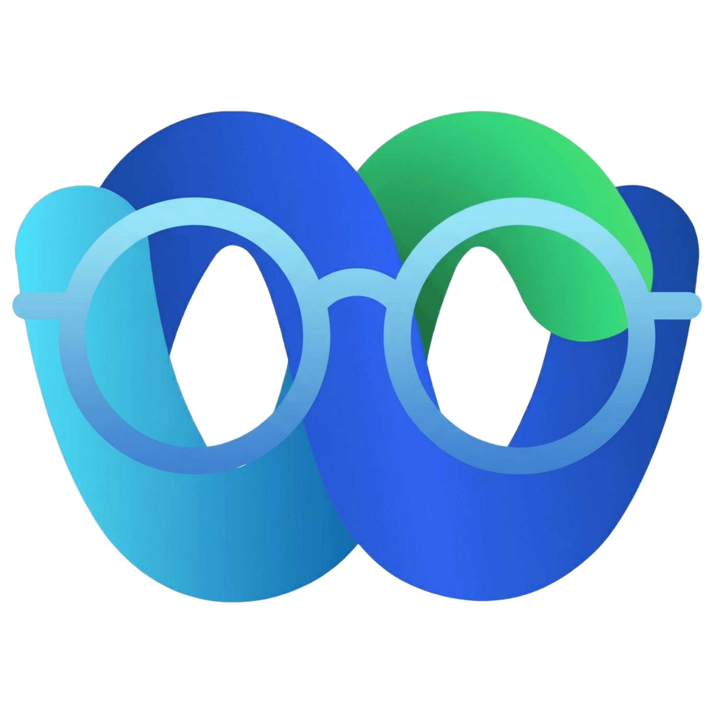

#  Polimi Webex Assistant

   
  <a href="https://chromewebstore.google.com/detail/iajeiajiibocdhcdhopeckdalaeeihln?utm_source=item-share-cb" style="text-decoration:none;">
    <strong style="font-size:24px;">Installa su Chrome</strong>
  </a>
  &nbsp;&nbsp;&nbsp;
  
    

**Polimi Webex Assistant** è un'estensione per Google Chrome (e browser basati su Chromium) sviluppata per migliorare radicalmente l'esperienza di fruizione delle lezioni registrate e dei video su **Webex**, **Microsoft Stream (SharePoint)** e sul portale **RecMan di Polimi**.

L'estensione ottimizza il tempo di studio permettendo di velocizzare la riproduzione, saltare automaticamente i silenzi e calcolare il tempo di visione effettivo in base alla velocità impostata.

---

## 🌐 Piattaforme Supportate

L'estensione si attiva automaticamente sui seguenti domini:
*   **Cisco Webex** (`*.webex.com`) - Riproduttore video ed interfaccia di login.
*   **Microsoft Stream / SharePoint** (`*.sharepoint.com`) - Lezioni caricate su cloud istituzionali.
*   **RecMan Polimi** (`*.ceda.polimi.it`) - Portale ufficiale delle registrazioni delle lezioni del Politecnico di Milano.

---

## ✨ Funzionalità in Dettaglio

### ⏭️ Skip Automatico dei Silenzi (Silence Skipper)
Grazie all'integrazione con le **Web Audio API**, l'estensione analizza lo spettro audio del video in tempo reale:
*   **Soglia Volume (Volume Threshold)**: Regolabile da `0%` a `20%`. Sotto questo livello, l'estensione considera il frammento come "silenzioso" (il segnale viene leggermente amplificato per supportare i video SharePoint a basso volume).
*   **Ritardo Skip (Skip Delay)**: Regolabile da `0.0s` a `3.0s`. Definisce la durata minima del silenzio continuativo prima che si attivi l'accelerazione.
*   **Velocità di Skip**: Regolabile da `2.0x` a `16.0x`. Quando viene rilevato un silenzio, il video avanza rapidamente a questa velocità, ritornando istantaneamente alla velocità normale appena il docente riprende a parlare.

### ⚡ Controllo Preciso della Velocità
Supera i limiti imposti dai player nativi:
*   **Slider Lineare**: Permette di impostare una velocità da `0.25x` a `10.00x` con incrementi di `0.25x`.
*   **Sincronizzazione Bidirezionale**: Se cambi la velocità usando i menu interni di Webex o SharePoint, l'estensione intercetta la selezione e aggiorna automaticamente i propri parametri e lo slider nel popup.
*   **Pulsante di Reset**: Ripristina istantaneamente la velocità a `1.00x` con un click.

### ⏱️ Stima del Tempo Rimanente Effettivo
*   Calcola la durata residua del video **scalata in base alla velocità di riproduzione corrente** ($TempoRimanente = TempoNominale / Velocità$).
*   **Iniezione nel Player**: Mostra il tempo calcolato (es. `[- 12:34]`) sia all'interno del popup che direttamente nella barra dei controlli del player originale (compatibile con i player Webex e SharePoint/FluentUI).

### 🔑 Autocompilazione Login (SSO Webex)
*   Memorizza in sicurezza la tua email istituzionale (`@mail.polimi.it` o `@polimi.it`).
*   Rileva la pagina di login SSO e inserisce automaticamente le credenziali procedendo con l'invio del form, riducendo a zero i passaggi ripetitivi per accedere alle lezioni.

### 🌙 Smart Dark Mode (Modalità Scura)
*   Applica un tema scuro iniettando filtri CSS intelligenti a livello del tag `<html>`.
*   **Re-inversione mirata**: Previene l'inversione di colori su flussi video, canvas di disegno, immagini e avatar per mantenerli naturali.
*   **Fix Full-Screen**: Gestisce correttamente lo stato a schermo intero per evitare conflitti di inversione.
*   **Personalizzazione per dominio**: Può essere attivata o disattivata selettivamente per Webex e RecMan Polimi direttamente dalle opzioni avanzate del popup.

---

## 🛠️ Installazione

### 🌟 Metodo 1: Chrome Web Store (Consigliato)
L'installazione tramite lo store ufficiale garantisce aggiornamenti automatici ad ogni nuova release:
1. Apri la pagina dell'estensione: **[Polimi Webex Assistant sul Chrome Web Store](https://chromewebstore.google.com/detail/iajeiajiibocdhcdhopeckdalaeeihln)**
2. Clicca su **Aggiungi** e poi su **Aggiungi estensione**.
3. Consigliato: Clicca sull'icona dei puzzle 🧩 in alto a destra e fissa (Pin 📌) l'estensione per averla sempre a portata di mano.

### 🔧 Metodo 2: Caricamento Locale (Developer Mode)
Utile per testare modifiche locali o versioni non ancora pubblicate:
1. Scarica l'ultima release o clona questa repository.
2. Estrai l'archivio ZIP sul tuo computer in una cartella permanente.
3. Apri Google Chrome e naviga su `chrome://extensions/`.
4. Abilita la **Modalità sviluppatore** (in alto a destra).
5. Clicca su **Carica estensione non pacchettizzata** in alto a sinistra.
6. Seleziona la cartella `webex_assistant_extension` (quella contenente il file `manifest.json`).

---

## 💡 Note Importanti per l'Uso & Troubleshooting

> [!IMPORTANT]
> **Attivazione dell'Audio (Sicurezza di Chrome)**
> Per motivi di sicurezza legati alle policy di riproduzione dei browser Chromium, le API audio non possono analizzare il flusso del video finché l'utente non interagisce con la pagina. 
> Se la funzione **Skip dei Silenzi** non si attiva o sembra non rispondere, **fai clic in un punto qualsiasi della pagina o del lettore video** per avviare il monitoraggio audio.

> [!NOTE]
> **Privacy e Sicurezza**
> L'estensione esegue tutta l'elaborazione dei dati ed il salvataggio dei parametri (inclusa la mail universitaria) **esclusivamente in locale** sul tuo dispositivo tramite le API `chrome.storage.local`. Nessun dato viene trasmesso all'esterno o salvato su server remoti.

---

## 💻 Architettura Tecnica

Il progetto è strutturato in modo leggero e performante senza l'uso di framework esterni:
*   `manifest.json`: Definisce le autorizzazioni (storage), i pattern di attivazione dell'estensione per i domini Webex, SharePoint e RecMan Polimi utilizzando le specifiche **Manifest V3**.
*   [content.js](file:///C:/Users/Lorenzo/IdeaProjects/webex_assistant/webex_assistant_extension/content.js): Script iniettato nelle pagine web. Si occupa del rilevamento dei video, della gestione dell'AudioContext, del calcolo del tempo rimanente e dell'iniezione dell'interfaccia nel player.
*   [popup.html](file:///C:/Users/Lorenzo/IdeaProjects/webex_assistant/webex_assistant_extension/popup.html) & [popup.js](file:///C:/Users/Lorenzo/IdeaProjects/webex_assistant/webex_assistant_extension/popup.js): Definiscono l'interfaccia grafica popup dell'estensione (gestione dello stato, regolazione dei parametri in tempo reale tramite messaggistica inter-script).

## 🐛 Supporto e Segnalazioni

Per segnalare problemi o proporre miglioramenti, è possibile aprire una **[Issue](https://github.com/lorenzovitale1/webex_assistant/issues)** all'interno di questa repository.
